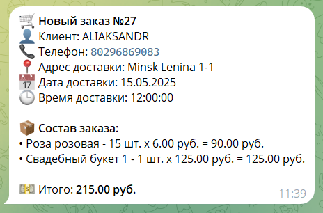

# Flower_shop
## Сайт с доставкой цветов

### *На сайте реализованы следующие функции: *
    * Регистрация и авторизация пользователей.
    * Просмотр каталога цветов.
    * Фильтрация каталога по категориям.
    * Выбор цветов и добавление в корзину.
    * Оформление заказа с указанием данных для доставки.
    * Информирование покупателя о создании заказа и изменения статуса через email.
    * Просмотр истории заказов.
    * Возможность повторного заказа, той же позиции из истории.
    * Панель администратора для управления заказами.
    * Информирование Администратора через телеграм-бота о новом заказе.
    * Изменения статуса заказа Администратором в телеграм-боте или в панели управления.

### *Пример уведомления Администратора о новом заказе в телеграм:*

### *Для корректной работы сайта и телеграм-бота необходимо ввести свои данные:*
    * TOKEN - токен от @BotFather
    * CHAT_ID - id чата Администратора (узнать можно с помощью @userinfobot)
    * EMAIL_HOST_PASSWORD - пароль почтового сервера
    * EMAIL_HOST_USER - почта с которой отправляются письма пользователям
    * ADMIN_PANEL_URL - url вашей административной панели
